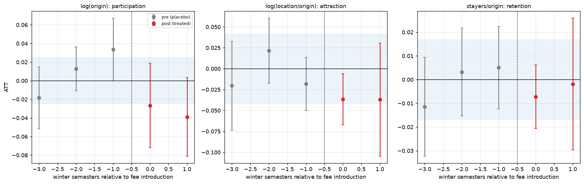

# Did tuition fees reduce university enrolment in Germany, and where did the students go?

Two linked difference-in-differences studies of the 2006 to 2014 German tuition-fee episode,
built on public Destatis data.

**Phase 1.** Introducing fees reduced first-year enrolment at the fee states' universities by
roughly **5 to 7 percent**. Distinguishable from zero under randomisation inference
(p = 0.009), stable in sign across every comparison group, dropped state and placebo date
tested. The honest interval is wide, about -1% to -12%.

**Phase 2.** That fall splits almost exactly in half: **2.9% fewer school leavers from fee
states went to university at all**, and **fee states' universities took in 3.6% fewer
first-years, relative to how many of their own school leavers started university**. Both deterrence and diversion, in similar measure. The two halves sum to -6.4%,
reproducing phase 1 on an independently constructed outcome, but neither half individually
clears the threshold this design can detect, so the split is a point estimate rather than an
established result.

**Phase 3.** A test of whether the effect reversed when fees were abolished was designed
and powered before any estimation, and found too weak to answer: its minimum detectable
effect (16 to 36 percent) is four to ten times larger than the reversal it had to detect
(2.9 to 3.6 percent). See below.

> **Status:** three phases complete. `DESIGN.md` was written before any code and records
> every subsequent revision with its reasoning, including the phase 3 outcome.

---

## The question

Seven of sixteen German states introduced general tuition fees of up to 500 euros per
semester between 2006 and 2008. Nine never did. All seven had abolished them again by 2014.

Did fees stop people studying, or move them to the state next door? **Deterrence** means a
fee reduces participation. **Diversion** means the same students enrol elsewhere, exporting
students and tuition revenue across a state border. The two imply opposite policy
conclusions and most of the public debate ran them together.

Phase 1 measures enrolment at the university's location, which responds to both margins and
cannot separate them. Phase 2 separates them.

## Why this design

| | |
|---|---|
| staggered adoption | 7 states, 3 introduction semesters, 2 winter-semester cohorts |
| never-treated comparison group | 9 states |
| phase 1 window | 1998 to 2007, 8 pre-periods |
| phase 2 window | 2003 to 2007, 3 pre-periods |

Both windows stop in 2007. Callaway-Sant'Anna requires absorbing treatment, and the fee
reversals violate it, so the introductions and the abolitions have to be two separate
experiments rather than one pooled panel.

---

# Phase 1: how much did enrolment fall?

## Specification, fixed before estimation

Committed in [`notebooks/03_pretrends_power.ipynb`](notebooks/03_pretrends_power.ipynb)
before any treatment effect was computed:

- **outcome:** log first-year students by university location (GENESIS 21311-0014), logged
  because state sizes differ roughly twentyfold
- **comparison group:** all nine never-treated states, chosen on power
- **minimum detectable effect: 5.5%.** Pre-committed rule: an estimate below this cannot be
  distinguished from zero by this design, so a null would be reported as uninformative rather
  than as evidence of no effect
- **inference:** clustered by state, plus wild cluster bootstrap, because 16 clusters is too
  few for the asymptotic approximation

### Treatment is coded as a binary regime, and that matters

Two distinct problems sit underneath that, worth separating because they have different
remedies. **Varying dose:** Bayern charged 300 to 500 euros depending on institution type,
and Hessen charged for only two semesters. **Partial compliance:** Nordrhein-Westfalen, the
largest state in the sample, left the decision to each university, so parts of it were never
effectively treated, which makes its estimate closer to an intent-to-treat effect.

Both attenuate toward zero, and the leave-one-out result is consistent: dropping
Nordrhein-Westfalen produces the weakest estimate of all sixteen drops (-5.51%). A
dose-response specification is deliberately not run, because fee levels were chosen by the
states rather than assigned, and a regression of effect size on euros would be fitting a
slope through seven self-selected points.

## Results

| estimator | effect | 95% CI | above the 5.5% MDE? |
|---|---|---|---|
| TWFE (diagnostic only) | -4.89% | -8.64% to -1.00% | no |
| **Callaway-Sant'Anna (primary)** | **-6.28%** | -9.54% to -2.91% | yes |


No anticipation: period -1 is +0.5% (CI -3.3% to +4.3%), despite Hessen having fallen 5.2% in
the semester fees were *announced* rather than charged. The two post-periods are -5.98% and
-7.32%.

### Inference is weaker than the analytic errors suggest

Three independent benchmarks agree the analytic standard error of 0.0180 is too small: the
wild cluster bootstrap p-value is 0.065 against analytic 0.027; the spread of the eight
pre-period placebo estimates is 0.0300; the SD of 1 000 permutation draws is 0.0251. Rebuilt
on the placebo spread the interval is **-11.63% to -0.60%**, and that is the interval quoted.


The strongest single result is the randomisation p-value of **0.009**: treatment was
reassigned at random 1 000 times and only nine draws produced an effect this large.

## Robustness: six checks, failure conditions set in advance

| # | check | result | verdict |
|---|---|---|---|
| 1 | joint pre-trend test | randomisation p = 0.210 (chi2 p = 0.0003) | pass |
| 2 | placebo-based inference | placebo SD 0.0300 vs analytic SE 0.0180 | pass |
| 3 | in-time placebo | worst fake reform date +0.47% | pass |
| 4 | randomisation inference | p = 0.009 | pass |
| 5 | leave-one-state-out | -7.45% to -5.51%, none below the MDE | pass |
| 6 | western-only controls | -5.04% [-8.31%, -1.66%] | pass |


**The in-time placebos are informative, not merely null.** All three fake reform dates return
*positive* effects (+3.71%, +1.71%, +0.47%).

**No single state carries the result.** Sachsen-Anhalt, whose G8 double cohort landed in 2007
inside the control group and was the leading mechanical explanation, moves it by 0.09
percentage points.

**The east-west confound was treated as co-primary, not a footnote.** Restricted to the three
western never-treated states the estimate is -5.04% and still excludes zero, though it sits
below that group's own 6.1% detectability threshold, so it is consistent with the pooled
result rather than independent confirmation of it.

## The judgment call worth reading

The joint pre-trend test disagrees with itself: the asymptotic chi2 version rejects
(p = 0.0003), the permuted version does not (p = 0.210).

**The primary defence uses the standard test, not the substitute.** Parallel trends has to
hold approaching treatment, not eight years earlier. Restricted to leads -4 to -2 the
ordinary chi2 test gives **p = 0.507**. The linear pre-trend slope is +0.0062 log points per
period, p = 0.271. Both use the same distribution as the test that rejected. Three
specifications put the slope between +0.5 and +1.1 pp/yr, all positive.

**The permutation version is corroboration, with a caveat.** Randomisation inference assumes
exchangeability, and treatment here was politically determined and nearly collinear with east
and west, so the permutation distribution is too wide. That is conservative for the point
estimate in check 4 and **lenient** for a pre-trend test, which is the direction that flatters
the study. Hence the short-window chi2 result carries the defence.

Any residual pre-trend is **positive**, meaning treated states were gaining on controls before
fees arrived, so a trend of that shape works against the finding rather than producing it.

---

# Phase 2: deterrence or diversion?

## The data that makes it possible

Phase 1's outcome counts students where they enrol, so a student who abandoned higher
education and one who crossed a border are identical in it. Separating them needs to know
where students came **from**.

Source: **Fachserie 11 Reihe 4.1, detailed table 6**, one workbook per winter semester, sheet
`TAB-06`. It is a 16 by 16 matrix of first-years by study state and by the state where the
university entrance qualification was earned, with `Ausland` and `ohne Angabe` separate.

The row and column margins give three quantities from one table: `study_location`
(phase 1's outcome), `origin` (first-years **from** a state, wherever they enrolled), and the
full flow matrix between them.

**Validation.** `study_location` from the Fachserie was compared against
`first_years_location` from GENESIS 21311-0014 across 80 state-year cells. Maximum absolute
gap: **0**. Two publications, two extraction pipelines, identical in every cell.

**Window: 2003 to 2007**, five volumes, three pre-periods. Shorter than phase 1 because the
Fachserie is machine-readable only from WS 2003/04; earlier volumes exist as scans whose OCR
cannot be trusted for numeric tables. That is the main cost of this route.

## Outcomes, and one revision

| outcome | definition | MDE |
|---|---|---|
| participation | `log(origin)` | 2.52% |
| attraction | `log(german_location / origin)` | 4.23% |
| retention | `stayers / origin` | 0.0168 |

`DESIGN.md` originally specified net inflow in levels per 1 000. **It was found underpowered
and demoted**, on pre-treatment variance only, with no treatment-period information entering
the decision: dividing a difference by a small denominator made Bremen and Sachsen-Anhalt
carry residual standard deviations twice anyone else's, giving an MDE of 43.8 against an
observed movement near 24. The scale-free replacements are better powered and, being in log
points, comparable with phase 1. The levels variant is still reported.

Foreign and unrecorded origin, 13 to 14 percent of first-years, are removed from **both**
sides. The share ranges from 25.5% in Berlin to 7.2% in Schleswig-Holstein, moves within the
window, and the group means cross over in 2006, so leaving it in would have put
time-varying contamination aligned with the treatment date into the outcome.

## Results: both mechanisms, in similar measure

| outcome | ATT | 95% CI | MDE | randomisation p |
|---|---|---|---|---|
| participation | **-2.90%** | -7.10% to +1.20% | 2.52% | 0.344 |
| attraction | **-3.61%** | -7.20% to -0.14% | 4.23% | 0.134 |
| retention | -0.0060 | -0.0214 to +0.0094 | 0.0168 | 0.531 |

Nothing clears both its threshold and zero, so the pre-committed reading returns **neither
detected**.

**The decomposition is the finding.** Because `attraction` is `log(location) - log(origin)`,
the estimates are linked by an identity:

| component | ATT | as % |
|---|---|---|
| participation | -0.0295 | -2.91% |
| redistribution | -0.0367 | -3.61% |
| **sum** | **-0.0662** | **-6.41%** |

The identity holds to 8.9e-16 and the total reproduces phase 1's -6.28%. Roughly **45 percent
of the fall is people not enrolling anywhere and 55 percent is people enrolling elsewhere.**

And that is exactly why neither is detected: splitting a 6.4 percent effect in two leaves
each half near or below its threshold. **The design can see the total but not the split.**



## Where did they go? Not next door

`DESIGN.md` predicted flows from fee states into **bordering fee-free** states should rise,
since that is where avoiding the fee is cheapest. Tested on 240 ordered state pairs per year,
with pair, origin-year and destination-year fixed effects, so anything affecting a state's
total outflow is absorbed and only the destination mix is left:

| specification | coefficient | p |
|---|---|---|
| any fee-free destination | **-0.119** | 0.018 |
| plus bordering interaction | -0.111, border -0.036 | 0.042, 0.459 |
| western destinations only | -0.122 | 0.083 |

Flows into fee-free destinations **fell** about 12 percent relative to flows into fee-charging
destinations, and the bordering interaction is near zero. The descriptive shares agree: the
bordering never-fee share of fee-state outflow runs 25.3, 26.1, 24.5, 24.2, 24.1 across the
window, flat through treatment.

**One caveat kept honest.** By WS 2007/08, 66.1% of flows into fee-free destinations went
east, because almost every western state was charging. Restricting to western destinations
keeps the sign and magnitude and weakens significance to p = 0.083.

This does not overturn the attraction estimate, which is about students hosted relative to
students produced and can fall because a state attracts fewer from anywhere. It rules out the
specific story that students crossed the nearest border.

## Phase 2 robustness

Leave-one-state-out keeps attraction between **-4.94% and -2.78%** with no sign flips across
all sixteen drops, and the full specification curve spans -4.82% to -2.74%. The
foreign-student decision changes the estimate by 0.13 percentage points.

A comparison group with **no G8 double cohort at all** makes attraction stronger (-4.79%) and
participation weaker (-1.67%), so Sachsen-Anhalt's 2007 double cohort was masking part of the
attraction effect rather than manufacturing it.

Under **western-only controls** every phase 2 estimate weakens and none clears its threshold.

---

# Phase 3: does the effect reverse when fees are abolished?

If fees caused the fall, abolishing them should reverse it, and a reversal would have turned
phase 2's split from a point estimate into a confirmed result. Seven states abolished fees
between WS 2008/09 and WS 2014/15, on the same Fachserie table phase 2 reads.

The design (`DESIGN.md` section 15) was committed before any phase 3 code. Its power
calculation, run before estimation by exact enumeration of all 720 assignments of the
abolition dates, shows the minimum detectable effect is **16 to 36 percent** against a
reversal of **3 to 4 percent** to detect. The abolitions coincided with the Hochschulpakt
expansion, the end of conscription and G8 double cohorts in most states, and the same outcomes
are two to four times noisier in that window than in phase 2's.

So no reversal is detected, and that is **not** evidence against phases 1 and 2: the design
could not have seen one. Details, including a disclosure that the point estimates were
printed once before the power calculation, are in
[`notebooks/10_phase3_power.ipynb`](notebooks/10_phase3_power.ipynb) and `DESIGN.md` 15.8.

---

## What this study cannot say

- **That the phase 2 split is established.** Both halves are point estimates below their
  detection thresholds. Pure deterrence and pure diversion both sit inside the intervals.
- **A precise magnitude for phase 1.** Anything from about 1% to 12% is consistent with the
  data. The estimate also sits only just above its 5.5% threshold, and in that regime
  estimates that clear significance are systematically inflated (a type-M error), so the true
  effect is plausibly smaller than the headline.
- **Anything about the abolitions.** Treatment reversal breaks the absorbing-treatment
  assumption, so that is a separate experiment.
- **Anything about dose.** Treatment is binary. A 500 euro fee charged everywhere and an
  opt-in regime where some universities charged nothing are the same value.
- **A clean east-west separation.** Treatment status is close to collinear with geography,
  and the western-only specification is the best available answer and underpowered.
- **That adoption was unrelated to state politics.** Fees followed the 2005 constitutional
  court ruling and were introduced overwhelmingly by CDU/CSU-led governments, while the three
  western never-treated states were SPD-led. Geography is the visible shadow of that
  selection, not its cause, so the western-only comparison narrows the problem without
  removing it. Bounding it properly needs a sensitivity analysis over the size of a possible
  violation (Rambachan and Roth), scheduled for future work.
- **That phase 2's pre-trends are clean enough.** With three pre-periods, a pre-trend roughly
  three times the size of the effect would pass the test unrejected.
- **Whether the effect reversed when fees were abolished.** The phase 3 design is four to
  ten times too underpowered to tell.

## Reproduce it

```bash
pip install -r requirements.txt
python src/acquire.py     # prints the exact sources and how to slice them
# ...download the GENESIS CSV into data/raw/ and the Fachserie xls into data/raw/fachserie/
python run_all.py         # builds the panel and runs the pipeline tests
# then run notebooks/01-10 in order
```

Raw data is gitignored. `src/acquire.py` is the reproducible record of which tables to pull;
`tests/` holds 33 guards over the panel, the hand-coded treatment dates and the Fachserie
extraction, including the cell-by-cell reconciliation between the two publications. Random
seeds are fixed, so the permutation results reproduce exactly.

## Repository layout

```
DESIGN.md              identification strategy; section 14 phase 2, section 15 phase 3
run_all.py             single entry point for the pipeline
data/
  raw/                 GENESIS download and Fachserie volumes (gitignored)
  treatment/           fee_dates.csv, g8_dates.csv, adjacency.csv (hand-coded, sourced)
  processed/           panel.parquet (gitignored, rebuildable)
sql/build_panel.sql    DuckDB panel construction
src/
  acquire.py           which sources to pull and how to slice them
  validate.py          data-quality gate (DESIGN.md 9)
  build_panel.py       raw CSVs -> analysis panel
  fachserie.py         phase 2: origin-destination matrix extraction
  estimation.py        TWFE, Callaway-Sant'Anna, event study, MDE
  robustness.py        placebos, leave-one-out, comparison groups
notebooks/             01-05 phase 1, 06-09 phase 2, 10 phase 3
tests/                 33 pipeline guards (pytest)
results/
  figures/             plots used in the write-up
  tables/              estimation and robustness tables
```

**Design rule:** mechanics live in `src/`, interpretation lives in the notebooks. The modules
fit models and run checks; the notebooks choose the specification, read the diagnostics, and
state the caveats.
