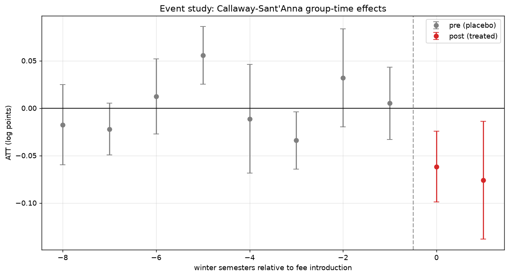
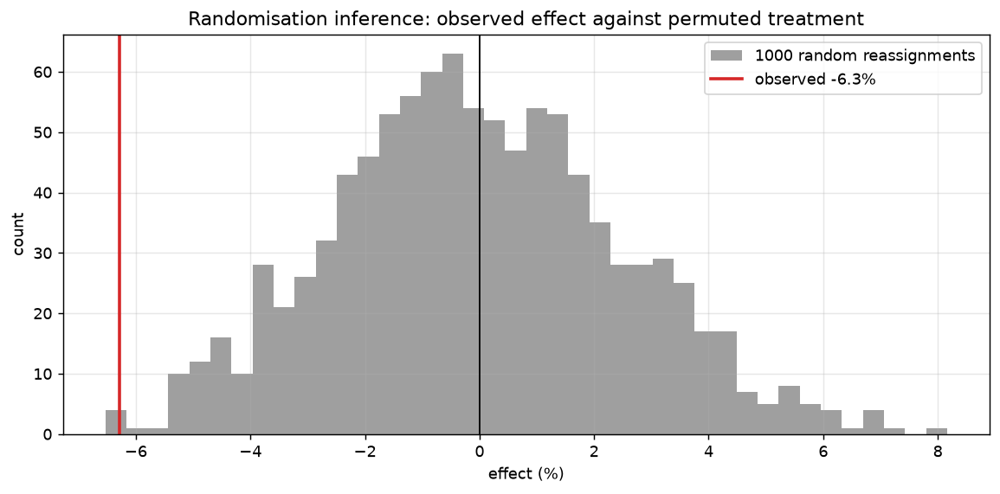
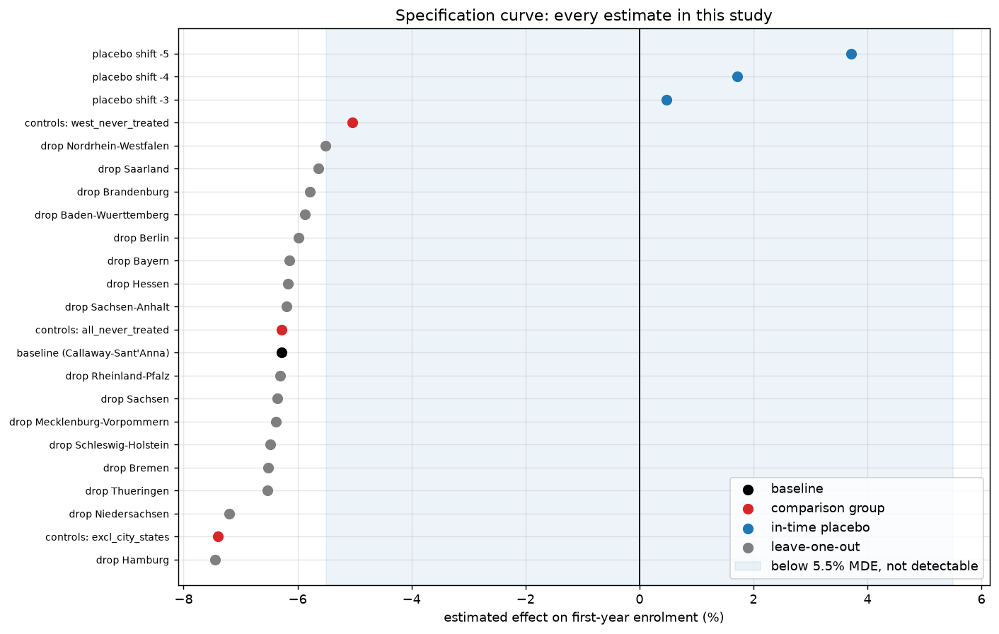

# Did tuition fees reduce university enrolment in Germany?

A staggered difference-in-differences study of the 2006-2014 German tuition-fee episode,
built on public Destatis data.

**Headline:** introducing fees reduced first-year enrolment in the fee states by roughly
**5 to 7 percent** relative to states that never charged them. The effect is distinguishable
from zero under randomisation inference (p = 0.009) and stable in sign across every
comparison group, dropped state and placebo date tested. The honest interval is wide, about
-1% to -12%, so the direction is far better established than the size.

> **Status:** phase 1 complete (introduction window, study-location outcome). Phase 2, which
> would separate deterrence from diversion and analyse the abolitions, is specified in
> [`DESIGN.md`](DESIGN.md) and not yet built. The design document was written before any code.

---

## The question

Seven of sixteen German states introduced general tuition fees of up to 500 euros per
semester between 2006 and 2008. Nine never did. All seven had abolished them again by 2014.

Did fees stop people studying, or did they move students to the state next door?
**Deterrence** means a fee reduces participation. **Diversion** means the same students
enrol elsewhere, exporting students and tuition revenue across a state border. The two imply
opposite policy conclusions and most of the public debate ran them together.

This phase measures the combined effect on enrolment at the university's location, which
responds to both margins. Separating them is phase 2 and is not claimed here.

## Why this design

| | |
|---|---|
| staggered adoption | 7 states, 3 introduction semesters, 2 winter-semester cohorts |
| never-treated comparison group | 9 states |
| pre-period | 8 winter semesters, from WS 1998/99 |
| estimation window | 1998 to 2007, ending before the first abolition |

The window stops in 2007 on purpose. Callaway-Sant'Anna requires absorbing treatment, and
the fee reversals violate that, so the introductions and the abolitions have to be estimated
as two separate experiments rather than pooled into one. The abolition window is phase 2.

## Specification, fixed before estimation

Everything below was committed in [`notebooks/03_pretrends_power.ipynb`](notebooks/03_pretrends_power.ipynb)
before any treatment effect was computed:

- **outcome:** log first-year students by university location (GENESIS 21311-0014), logged
  because state sizes differ roughly twentyfold
- **comparison group:** all nine never-treated states, chosen on power
- **minimum detectable effect: 5.5%.** Pre-committed rule: an estimate below this cannot be
  distinguished from zero by this design, so a null would be reported as uninformative rather
  than as evidence of no effect
- **inference:** clustered by state, plus wild cluster bootstrap, because 16 clusters is too
  few for the asymptotic approximation

Normalising by each state's school-leaver cohort was considered and rejected: students
enrolled in a state did not all attend school there, so the ratio would measure inflow per
local school leaver rather than enrolment propensity.

### Treatment is coded as a binary regime, and that matters

`data/treatment/fee_dates.csv` records each state's decision date, introduction semester and
abolition semester with a source note. Three states introduced fees in the summer semester of
2007, so their first affected winter intake is WS 2007/08 and they enter the same cohort as
the WS 2007/08 states.

The indicator marks *whether a general fee regime was in force*, not how much was charged,
and the regimes were not uniform. Two distinct problems sit underneath that, and they are
worth separating because they are different failures with different remedies.

**Varying dose.** Bayern charged between 300 and 500 euros depending on institution type, and
Hessen charged for only two semesters before abolishing. Treated units received genuinely
different amounts of treatment, so the coefficient is an average over a range of doses.

**Partial compliance.** Nordrhein-Westfalen, the largest state in the sample, left the
decision to each university, so some units inside a state coded as treated were never
actually treated. That is not dose variation but non-compliance, and it makes the estimate
for that state closer to an intent-to-treat effect than to an effect of paying fees.

Both attenuate the estimate toward zero, and the leave-one-out result is consistent with it:
dropping Nordrhein-Westfalen produces the weakest estimate of all sixteen drops (-5.51%),
which is what you would expect if its partial treatment were diluting the treated group.

A dose-response specification would be the obvious next move and is deliberately not run.
Fee levels were chosen by the states, not assigned, so a regression of effect size on euros
would be fitting a slope through seven self-selected points. That would look more precise and
be less defensible.

That does not make the reported effect a lower bound. It pushes one way; the type-M problem
below pushes the other. The net direction is not something this design can sign.

## Results

| estimator | effect | 95% CI | above the 5.5% MDE? |
|---|---|---|---|
| TWFE (diagnostic only) | -4.89% | -8.64% to -1.00% | no |
| **Callaway-Sant'Anna (primary)** | **-6.28%** | -9.54% to -2.91% | yes |

TWFE is reported and then set aside: under staggered adoption it uses already-treated states
as controls, and the smaller estimate is the expected direction of that bias.



The event study shows no anticipation. Period -1 is +0.5% (CI -3.3% to +4.3%), flat and
centred on zero, despite Hessen having fallen 5.2% in the semester fees were *announced*
rather than charged. The two post-periods are -5.98% and -7.32%, so the effect grows rather
than spiking and decaying, though with only two post-periods that is suggestive at best.

### Inference is weaker than the analytic errors suggest

Three independent benchmarks agree that the analytic standard error of 0.0180 is too small:

- wild cluster bootstrap p-value 0.065 against analytic 0.027, a factor of 2.4
- spread of the eight pre-period placebo estimates: 0.0300, a factor of 1.66
- SD of 1000 permutation draws: 0.0251, a factor of 1.39

Rebuilt on the placebo spread the interval is **-11.63% to -0.60%**. It still excludes zero,
but only just, and that is the interval quoted rather than the analytic one.



The strongest single result in the study is the randomisation p-value of **0.009**: treatment
was reassigned at random across the sixteen states 1000 times, holding the cohort structure
fixed, and only nine draws produced an effect this large in magnitude. It rests on no
distributional assumption and no cluster-count assumption at all.

## Robustness: six checks, each with a failure condition set in advance

| # | check | result | verdict |
|---|---|---|---|
| 1 | joint pre-trend test | randomisation p = 0.210 (chi2 p = 0.0003) | pass |
| 2 | placebo-based inference | placebo SD 0.0300 vs analytic SE 0.0180 | pass |
| 3 | in-time placebo | worst fake reform date +0.47% | pass |
| 4 | randomisation inference | p = 0.009 | pass |
| 5 | leave-one-state-out | -7.45% to -5.51%, none below the MDE | pass |
| 6 | western-only controls | -5.04% [-8.31%, -1.66%] | pass |



**The in-time placebos are informative, not merely null.** All three fake reform dates return
*positive* effects (+3.71%, +1.71%, +0.47%). A design prone to manufacturing negative results
would have produced at least one.

**No single state carries the result.** Across all sixteen drops the estimate stays between
-7.45% and -5.51%. Sachsen-Anhalt, whose G8 double cohort landed in 2007 inside the control
group and was the leading mechanical explanation for the finding, moves it by 0.09 percentage
points.

**The east-west confound was treated as a co-primary test, not a footnote.** All seven fee
states are western and six of the nine never-treated states are eastern, so a comparison
leaning on eastern controls is partly measuring east against west. Restricted to the three
western never-treated states the estimate is -5.04% and still excludes zero. One
qualification worth stating: that figure sits below the western group's own detectability
threshold, which notebook 03 fixed at 6.1% before estimation, so it is consistent with the
pooled result rather than independent confirmation of it. Excluding the city states, whose enrolment is dominated by inflow, gives
-7.40%. The three groups span -5.04% to -7.40%, all negative, all excluding zero.

## The judgment call worth reading

The joint pre-trend test disagrees with itself. The textbook asymptotic version rejects
parallel trends (chi2 p = 0.0003); the same statistic permuted across states does not
(p = 0.210). Reporting a pass on the second is the kind of move that turns a robustness
section into theatre, so the argument is set out rather than assumed.

**The primary defence uses the standard test, not the substitute.** Parallel trends has to
hold in the periods approaching treatment, not eight years earlier. Restricted to leads -4
to -2, the ordinary chi2 test gives **p = 0.507** and does not come close to rejecting. The
linear pre-trend slope over the whole pre-window is +0.0062 log points per period with
p = 0.271, also on standard inference. Both of these use the same distribution as the test
that rejected. The rejection is driven by the distant leads, where the treated and control
groups were further apart and where the parallel-trends assumption is not doing identifying
work.

**The permutation version is corroboration, and it comes with a caveat.** `pyfixest` forces
a chi2 reference distribution for a restriction matrix of this shape, and chi2 assumes many
clusters; there are 16, of which 7 are treated. Permuting the statistic removes that
assumption and agrees with the short-window result.

It is not a free upgrade, though. Randomisation inference assumes exchangeability under the
null, and treatment here was politically determined and nearly collinear with east and west,
so the permutation distribution contains assignments that could never have occurred, such as
an all-eastern treated group. That makes it too wide. **Too wide cuts different ways for the
two places this study uses it:** for the point estimate in check 4 it is conservative, so
p = 0.009 is if anything understated; for a pre-trend test it is lenient, which is the
direction that flatters the study. That is precisely why the short-window chi2 result carries
the defence here and the permutation result only supports it.

The chi2 rejection is reported rather than deleted, because a reader running the textbook
test on the full window will get it and should find it addressed.

**Direction of any residual pre-trend.** Three specifications estimate it and all three
agree: +0.50 percentage points per year from the pre-period regression in notebook 03, +1.12
from the unnormalised log gap, and +0.62 from the event-study slope in notebook 05. The slope
is positive on every reading, meaning treated states were gaining on controls before fees
arrived. Projected forward it predicts a positive
post-treatment gap. The estimate is negative, so a residual trend of this shape works against
the finding rather than producing it.

## What this study cannot say

- **Deterrence versus diversion.** The outcome moves when someone does not enrol at all and
  when they enrol one state over. Separating them needs the home-state outcome and the
  derived net-migration measure specified in `DESIGN.md` 6.1.
- **A precise magnitude.** Anything from about 1% to 12% is consistent with the data. The
  point estimate of 6.28% also sits only just above the 5.5% detectable effect, and in that
  regime estimates that clear significance are systematically inflated in magnitude (a type-M
  error). The true effect is plausibly smaller than the headline figure.
- **Anything about the abolitions.** Treatment reversal breaks the absorbing-treatment
  assumption, so that is a separate experiment.
- **Anything about dose.** Treatment is binary. A 500 euro fee charged at every university
  and an opt-in regime where some universities charged nothing are the same value of the
  indicator.
- **A clean east-west separation.** Treatment status is close to collinear with geography.
  The western-only specification is the best available answer and it is underpowered.
- **That adoption was unrelated to state politics.** Fees followed the 2005 constitutional
  court ruling and were introduced overwhelmingly by CDU/CSU-led governments, while the three
  western never-treated states were SPD-led. Geography is the visible shadow of that
  selection, not its cause, so the western-only comparison narrows the problem without
  removing it: the cleanest comparison available here is still centre-right states against
  centre-left ones. If party control correlates with anything that moves enrolment
  trajectories, higher-education budgets or labour markets, it is inside the estimate. The
  near-lead pre-trend test is the relevant evidence against this and does not reject
  (p = 0.507), but a confound that switches on in 2006 would not show up there at all.
  Bounding it properly needs a sensitivity analysis over the size of a possible violation
  (Rambachan and Roth), which `DESIGN.md` schedules for phase 2.

## Reproduce it

```bash
pip install -r requirements.txt
python src/acquire.py     # prints the exact GENESIS tables and slicing to download
# ...download the CSVs into data/raw/ (GENESIS needs an interactive login)
python run_all.py         # builds the panel and runs the pipeline tests
# then run notebooks/01-05 in order
```

Raw data is gitignored. `src/acquire.py` is the reproducible record of which tables to pull
and how to slice them; `tests/` guards the panel against the silent failures that are easy to
miss (single-period downloads, unbalanced panels, treatment flags drifting out of sync with
the source table). Random seeds are fixed, so the permutation results reproduce exactly.

## Repository layout

```
DESIGN.md              identification strategy, incl. section 0 feasibility check
run_all.py             single entry point for the pipeline
data/
  raw/                 GENESIS downloads (gitignored)
  treatment/           fee_dates.csv, g8_dates.csv (hand-coded, sourced)
  processed/           panel.parquet (gitignored, rebuildable)
sql/build_panel.sql    DuckDB panel construction
src/
  acquire.py           which tables to pull and how to slice them
  validate.py          data-quality gate (DESIGN.md 9)
  build_panel.py       raw CSVs -> analysis panel
  estimation.py        TWFE, identification anatomy, Callaway-Sant'Anna, MDE
  robustness.py        placebos, leave-one-out, comparison groups, east/west
notebooks/             01 validation, 02 EDA, 03 pretrends+power, 04 estimation, 05 robustness
tests/                 pipeline guards (pytest)
results/
  figures/             plots used in the write-up
  tables/              estimation and robustness tables
```

**Design rule:** mechanics live in `src/`, interpretation lives in the notebooks. The modules
fit models and run checks; the notebooks choose the specification, read the diagnostics, and
state the caveats.
